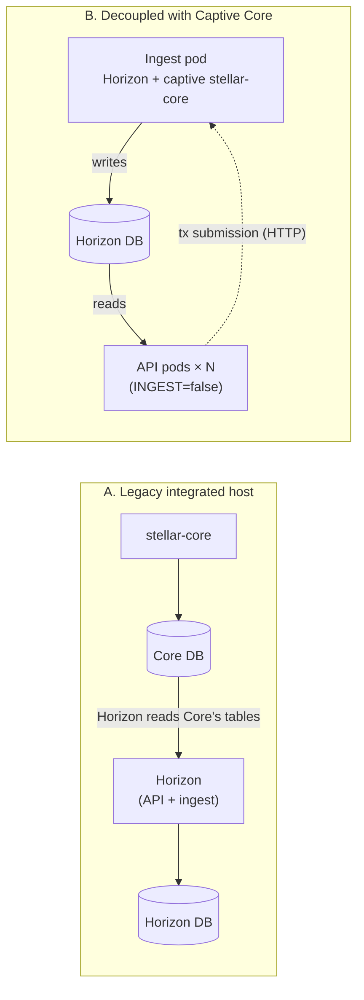

# Core/Horizon Decoupled Architecture Guide

Legacy Stellar deployments ran Stellar Core, Horizon, and both of their databases
on one host. That host was a single point of failure, and it could only be
scaled by buying a bigger machine. This guide explains the modern **decoupled**
architecture built on **Captive Core**:

- one isolated ingestion pod owns the only Stellar Core process;
- a tier of read-only Horizon API pods scales horizontally, like any stateless
  web service.

It also shows how to migrate a legacy integrated deployment onto
cloud-native volumes.

| File | Purpose |
|---|---|
| [`examples/architecture/captive-core-scaling.yaml`](../../examples/architecture/captive-core-scaling.yaml) | Reference topology: 1 ingest pod (Captive Core) plus 5→50 API pods (HPA) |
| [`examples/architecture/validation/`](../../examples/architecture/validation/) | kind validation: a standalone Stellar network, a Kustomize overlay, and `verify.sh` |

Facts about Horizon internals below come from the source of
`stellar/stellar-horizon` (v29.0.0) and `stellar/go-stellar-sdk` (v0.7.2),
which Horizon uses for ingestion.

---

## Contents

- [1. Architectures compared](#1-architectures-compared)
- [2. How Captive Core feeds Horizon](#2-how-captive-core-feeds-horizon)
- [3. Captive Core IPC limits and horizontal scaling](#3-captive-core-ipc-limits-and-horizontal-scaling)
- [4. Reference topology](#4-reference-topology)
- [5. Deploying](#5-deploying)
- [6. Migrating a legacy integrated deployment](#6-migrating-a-legacy-integrated-deployment)
- [7. Operating the decoupled stack](#7-operating-the-decoupled-stack)
- [8. Validation](#8-validation)

---

## 1. Architectures compared



| | **Standalone Core feeding Horizon** (legacy) | **Captive Core** (current) |
|---|---|---|
| How ledgers reach Horizon | Core writes ledgers into **its own PostgreSQL DB**; Horizon reads Core's tables | Horizon runs `stellar-core` as a **child process** and reads ledger metadata from a pipe |
| Core database | Required (large, write-heavy PostgreSQL) | **None.** Captive Core keeps a private SQLite DB and BucketListDB under `CAPTIVE_CORE_STORAGE_PATH` |
| Processes to operate | Core + Core DB + Horizon + Horizon DB | Horizon (with an embedded Core) + Horizon DB |
| Coupling | Horizon depends on Core's DB schema and on Core staying healthy | Only the ingesting Horizon depends on its own Captive Core |
| Horizontal scaling | Every Horizon talks to the same Core DB; scaling adds load to it | API replicas need no Core at all; only the single ingester has one |
| Consensus participation | The same Core could also be a validator | Captive Core **never** validates; it only follows the network |
| Supported by current Horizon | **No.** Captive Core became the default in Horizon 2.0.0, remote Captive Core was removed in 2.27.0, and in-memory mode (`CAPTIVE_CORE_USE_DB`) was removed with Protocol 23 | **Yes.** It is the only ingestion mode |

**Benefits of decoupling:**

- **No Core database** to run, back up, or tune.
- **Independent scaling:** API throughput scales with pods and database reads,
  and ingestion is sized once.
- **Isolated failure domains:** an ingester restart or catch-up doesn't take
  down API reads.
- **Cloud-native storage:** each tier gets the volume type it needs (§6.3).

**Trade-offs to plan for:**

- **Each ingesting pod is a full Stellar Core.** It needs peer connectivity,
  history archive access, and its own CPU, RAM and SSD.
- **One active writer.** Ingestion throughput doesn't scale with replicas (§3).
- **Transaction submission** from API pods goes through the ingester's
  Captive Core over HTTP, or through a separate Core (§3.4).
- **You still need validators.** If your organisation participates in
  consensus, run them separately (the operator's `nodeType: Validator`); don't
  put them on Horizon hosts.

---

## 2. How Captive Core feeds Horizon

When `INGEST=true`, Horizon starts Stellar Core itself:

```
stellar-horizon (ingest)                                  (same container)
  └── stellar-core run --metadata-output-stream fd:3      child process
        │
        └── fd 3 ──► anonymous pipe ──► Horizon ledger reader ──► Horizon DB
```

- The pipe is an **anonymous OS pipe** (`os.Pipe()`). Its write end is passed
  to the child as file descriptor 3. It exists only between that parent and
  that child. There is no socket, no port and no protocol a second process
  could attach to.
- Captive Core catches up from the history archives, then follows the
  network through its peers. It writes one `LedgerCloseMeta` frame per ledger
  into the pipe.
- Captive Core keeps its state (a SQLite DB plus buckets) under
  `CAPTIVE_CORE_STORAGE_PATH`. Horizon **rejects** a Captive Core config that
  sets `BUCKET_DIR_PATH`, specifically to stop two Captive Cores from sharing
  bucket state.

When `INGEST=false`, Horizon starts **no** Core process, holds no pipe, and
serves the API from PostgreSQL only.

---

## 3. Captive Core IPC limits and horizontal scaling

### 3.1 The limits

The ledger stream is bounded by constants in go-stellar-sdk
(`ingest/ledgerbackend/buffered_meta_pipe_reader.go`). They can't be changed
through configuration:

| Limit | Value | Effect |
|---|---|---|
| Pipe read buffer | 10 MiB | Absorbs a few ledgers of metadata while Horizon processes earlier ones |
| Read-ahead | 20 ledgers | Decoded ledgers waiting for the ingestion loop |
| Max frame | 256 MiB | A single ledger's metadata larger than this is rejected |
| Consumers per pipe | **1** | Exactly one Horizon process reads each Captive Core's stream |

**Backpressure:** if Horizon ingests more slowly than the network closes
ledgers, the 20-ledger buffer fills and Captive Core's writes to the pipe
block. Core then falls behind the network, and `/health` on the ingest pod
reports it as not synced. The fix is **faster ingestion** (more CPU for the
ingest pod, and a faster database for writes), not more replicas.

### 3.2 What this means when you scale

| You add… | What happens | Recommendation |
|---|---|---|
| **API replicas** (`INGEST=false`) | No Core, no pipe, no Core storage. Each pod is only an HTTP server plus database connections | **Scale freely.** The limit is database read capacity (§7.2) |
| **Ingest replicas** (`INGEST=true`) | Each one is a **full, independent Captive Core** with its own pipe, CPU, RAM, PVC, peers and archive downloads. Horizon's `SELECT … FOR UPDATE` lock on `key_value_store` lets **only one** of them write, and the others wait as hot standbys | Run **1**, or **2** for faster failover. More adds cost, not throughput |
| A shared Captive Core for many Horizons | Impossible. The pipe can't cross a process boundary, and remote Captive Core was removed in Horizon 2.27.0 | Don't try to proxy it |
| Shared Captive Core storage (RWX volume) | Corrupts state, which is exactly what the `BUCKET_DIR_PATH` ban prevents | One RWO PVC per ingest pod (StatefulSet `volumeClaimTemplates`) |

### 3.3 Why API pods must not probe `/health`

Horizon's `/health` returns **503** unless the database is reachable **and**
Stellar Core is up and synced. If every API pod used it for readiness, one
ingester restart would pull the **whole** API tier out of rotation at once,
even though reads from the database were unaffected. The reference manifests
probe `/` on API pods and use `/health` only on the ingest pod.

### 3.4 Transaction submission

API pods submit transactions to Stellar Core over **plain HTTP**, not the
pipe. The reference topology points `STELLAR_CORE_URL` at the ingest pod's
Captive Core (`PUBLIC_HTTP_PORT=true`, port 11626). A NetworkPolicy allows only
API pods to reach that port, because Core's HTTP interface also exposes admin
commands.

Choose one:

| Option | Setting on API pods | When the ingester restarts |
|---|---|---|
| Via Captive Core (reference) | `STELLAR_CORE_URL=http://horizon-captive-core:11626` | Reads keep working; submissions return errors until it is back |
| Via a dedicated Core / validator | `STELLAR_CORE_URL=http://<your-core>:11626` | Submissions are independent of ingestion |
| Read-only tier | `DISABLE_TX_SUB=true` (then no `STELLAR_CORE_URL` is needed) | Nothing changes |

---

## 4. Reference topology

`captive-core-scaling.yaml` contains:

| Object | Role |
|---|---|
| ConfigMap `horizon-network` | `NETWORK=testnet`, shared by both tiers through `envFrom` |
| ConfigMap `horizon-captive-core` | Captive Core TOML: testnet quorum, `HTTP_PORT=11626`, `PUBLIC_HTTP_PORT=true`, `PEER_PORT=11725`. No `BUCKET_DIR_PATH` or `DATABASE` |
| StatefulSet `horizon-ingest` (replicas **1**) | `INGEST=true`, `APPLY_MIGRATIONS=true`; Captive Core storage on its own RWO PVC; generous `startupProbe` for catch-up; readiness on `/health` |
| Service `horizon-captive-core` | Port 11626 on the ingest pod, for transaction submission |
| NetworkPolicy `horizon-captive-core` | Only `component=api` pods may reach port 11626 on the ingest pod |
| Deployment `horizon-api` (replicas **5**) | `INGEST=false`; no PVC; read-only root filesystem; readiness on `/` |
| Service `horizon` | The public API. Selects **only** API pods, so the ingester never serves clients |
| HPA `horizon-api` | 5→50 replicas on CPU (requires metrics-server) |
| PDBs | API tier keeps ≥80% available; the single ingester may be drained |

Both tiers read and write the **same Horizon PostgreSQL database**. That
database is the *shared state* that makes every API replica return identical
results. The Captive Core state is private to the ingest pod and never shared.

---

## 5. Deploying

### 5.1 Database

Provision PostgreSQL for Horizon (a managed service or an in-cluster HA
cluster) and create the connection secret:

```bash
kubectl create namespace stellar
kubectl -n stellar create secret generic horizon-db \
  --from-literal=DATABASE_URL='postgres://horizon:<password>@<db-host>:5432/horizon?sslmode=require'
```

### 5.2 Apply

```bash
kubectl apply -f examples/architecture/captive-core-scaling.yaml
kubectl -n stellar rollout status statefulset/horizon-ingest --timeout=60m   # first catch-up
kubectl -n stellar rollout status deployment/horizon-api
```

### 5.3 Check the topology

```bash
# Exactly one `stellar-core run` process, in the ingest pod (prints 1)
kubectl -n stellar exec horizon-ingest-0 -- sh -c \
  'for p in /proc/[0-9]*; do tr "\0" " " < "$p/cmdline"; echo; done | grep -c "stellar-core.* run"'
# Ingestion lag: core_latest_ledger - history_latest_ledger should stay near 0
kubectl -n stellar port-forward svc/horizon 8000 &
curl -s localhost:8000/ | jq '{history_latest_ledger, core_latest_ledger}'
```

### 5.4 Pubnet

1. Set `NETWORK: pubnet` in `horizon-network`.
2. Replace `captive-core.cfg` with a Pubnet quorum **you have vetted**.
   The upstream starting point is
   [`captive-core-pubnet.cfg`](https://github.com/stellar/go-stellar-sdk/blob/v0.7.2/ingest/ledgerbackend/configs/captive-core-pubnet.cfg),
   which itself warns that quorum sets should be selected manually. Keep
   `HTTP_PORT=11626` and `PUBLIC_HTTP_PORT=true` if API pods submit
   transactions through it.
3. Size the ingest pod for Pubnet: at least 100Gi of SSD for
   `captive-core-storage`, and CPU/memory as set in the manifest. See
   [capacity planning](../operations/capacity-planning.md#12-horizon-api--ingestion-db).

---

## 6. Migrating a legacy integrated deployment

### 6.1 Inventory the legacy host

| Legacy asset | In the decoupled architecture |
|---|---|
| Stellar Core process | If it **validates**: move it to a dedicated validator (operator `nodeType: Validator`). If it only fed Horizon: **retire it**; Captive Core replaces it |
| Core PostgreSQL database | **Retire it.** Captive Core doesn't use it, and nothing is migrated from it |
| Core buckets directory | **Discard it.** Captive Core rebuilds its buckets from the history archives |
| Horizon PostgreSQL database | **Keep it or rebuild it** (§6.2); this is the only stateful asset worth moving |
| History archive publishing | Keep it on the validator, pointed at object storage |
| Horizon config (flags, env) | Re-express as the ConfigMaps and env in §4. Remove Core-DB flags (`STELLAR_CORE_DATABASE_URL`) and in-memory flags (`CAPTIVE_CORE_USE_DB`) |

### 6.2 Choose a migration strategy

| Strategy | Downtime | Keeps history | Best when |
|---|---|---|---|
| **A. Fresh ingest, then cut over** (recommended) | None (parallel run) | Only what you reingest | The history window is small, or you can backfill in parallel |
| **B. Move the existing Horizon DB** | Minutes (logical replication) to hours (dump/restore) | All of it | You serve deep history that is expensive to reingest |

**Strategy A: fresh ingest with parallel run.**

1. Deploy the decoupled stack (§5) against a **new, empty** database. The
   ingester builds current state from the latest checkpoint.
2. Backfill the history window your clients need, in parallel with
   ingestion:
   ```bash
   kubectl -n stellar exec horizon-ingest-0 -- stellar-horizon db reingest range \
     --parallel-workers 4 <from-ledger> <to-ledger>
   ```
   Set the retention you want with `HISTORY_RETENTION_COUNT`.
3. **Compare** old and new on the same ledgers:
   `history_latest_ledger` from `/`, then sample `/ledgers/<n>`,
   `/accounts/<id>` and `/transactions/<hash>`. Both systems read the same
   network, so the responses must be identical.
4. **Cut over** by switching DNS or the Ingress from the legacy host to Service
   `horizon`. Keep the legacy host running, read-only, for the rollback window.
5. **Roll back** by switching DNS back. The legacy host was never modified.

**Strategy B: move the existing Horizon database to a cloud-native volume.**

1. Upgrade the legacy Horizon to the **same version** you will run in
   Kubernetes (`stellar-horizon db migrate up`), so the schema matches.
2. Copy the database:
   - **Near-zero downtime:** PostgreSQL logical replication from the legacy
     DB (publisher) to the new PostgreSQL (subscriber) until caught up.
   - **Simple:** stop legacy ingestion, then
     `pg_dump -Fd -j 8` / `pg_restore -j 8` into the new PostgreSQL.
3. **Stop legacy ingestion** before any decoupled ingester starts. Two
   ingesters writing into two diverging copies is the one unrecoverable
   mistake.
4. Point `horizon-db` at the new database and apply the manifests. Horizon
   **resumes from the last ingested ledger** recorded in the database, and
   Captive Core catches up from the archives to that point.
5. Verify as in Strategy A, step 3, then cut over the API.

### 6.3 Map host paths to Kubernetes volumes

| Data | Legacy location | Decoupled volume | Access mode | Migrate? |
|---|---|---|---|---|
| Horizon DB | Local PostgreSQL | Managed PostgreSQL or an in-cluster HA cluster on SSD PVCs | RWO per DB member | **Yes** (§6.2) |
| Captive Core storage | n/a (new) | `volumeClaimTemplates` on the ingest StatefulSet, SSD | **RWO, one per ingester** | No, rebuilt from archives |
| Core DB and buckets | Local disk | None | n/a | No, retired |
| API pods | Same host | None (read-only root filesystem) | n/a | n/a |

---

## 7. Operating the decoupled stack

### 7.1 Upgrades

Upgrade the **ingest pod first**. It is the only one with
`APPLY_MIGRATIONS=true`, so it migrates the schema. Then roll the API
Deployment straight away. Old API pods that are already running keep serving,
but Horizon checks the schema version at startup and **refuses to start**
against a newer schema. Any old pod that restarts mid-rollout stays down until
it runs the new version.

### 7.2 Scaling the API tier

- API replicas are bounded by the **database**, not by Captive Core. Watch
  PostgreSQL CPU and connection count as the HPA adds pods, and put PgBouncer
  in front of the database for large replica counts.
- For read-heavy workloads, set `RO_DATABASE_URL` on API pods to a PostgreSQL
  read replica. Horizon returns a stale-history error when the replica lags,
  rather than serving outdated data silently.

### 7.3 Ingester availability

- With `replicas: 1`, an ingester restart pauses **ingestion only**. API
  reads continue from the database; responses simply show no new ledgers until
  Captive Core is back in sync.
- With `replicas: 2`, the standby keeps its own Captive Core synced and takes
  the ingestion lock within seconds of the active one stopping. It costs a
  second full Captive Core (§3.2).

### 7.4 Monitoring

| Signal | Where | Alert when |
|---|---|---|
| Ingestion lag | `core_latest_ledger - history_latest_ledger` on `/` | More than ~10 ledgers for several minutes (backpressure, §3.1) |
| Core sync | `/health` on `horizon-ingest-0` | 503 for longer than a catch-up window |
| API errors | Ingress / Horizon metrics (`ADMIN_PORT` `/metrics`) | 5xx rate |
| Captive Core disk | PVC usage | Over 80% |

### 7.5 Stellar-K8s operator

The operator's Horizon `StellarNode` maps `horizonConfig.enableIngest` to
Horizon's `INGEST` and sets `STELLAR_CORE_URL`. It renders a structured Captive
Core configuration only for `nodeType: SorobanRpc` today. For a decoupled
Horizon with Captive Core, use the reference manifests as shown. Alternatively,
run an API-only `StellarNode` (`enableIngest: false`, `replicas: N`) next to the
ingest StatefulSet from the manifest; both use the same database secret.

---

## 8. Validation

[`validation/verify.sh`](../../examples/architecture/validation/verify.sh)
deploys the reference manifest **unchanged in topology** on a single-node kind
cluster, through a Kustomize overlay that makes three changes:

- it points the manifest at a local standalone network (one validator using
  the accelerated-time settings from Horizon's own integration tests);
- it adds a throwaway PostgreSQL;
- it shrinks resource requests to fit a laptop.

It then checks:

| Check | Pass criteria |
|---|---|
| Captive Core placement | Exactly **1** `stellar-core run` process in the ingest pod, and **0** across all API pods |
| 5 API replicas serve requests | All 5 ready; each answers `/` and `/ledgers?order=desc&limit=1` with 200 (queried pod by pod, not through the Service) |
| Shared state | All replicas report the same `history_latest_ledger` (spread ≤ 2), and it advances on every replica between two samples 15 s apart |
| Submission path | Every replica reports `core_latest_ledger > 0`, i.e. it reaches the single Captive Core over HTTP |
| Horizontal scaling | At 10 API replicas, all serve 200 and there is still exactly **1** stellar-core process in the namespace |

```bash
cd examples/architecture/validation
./verify.sh            # create the cluster, run the checks, delete the cluster
./verify.sh --keep     # keep the cluster for inspection
```

Requirements: Docker (about 3 GB free for images), `kind`, `kubectl` (matching
kind's node version), `openssl`, `python3`.
