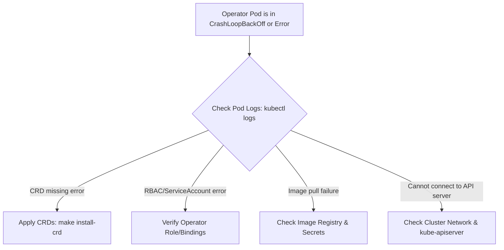
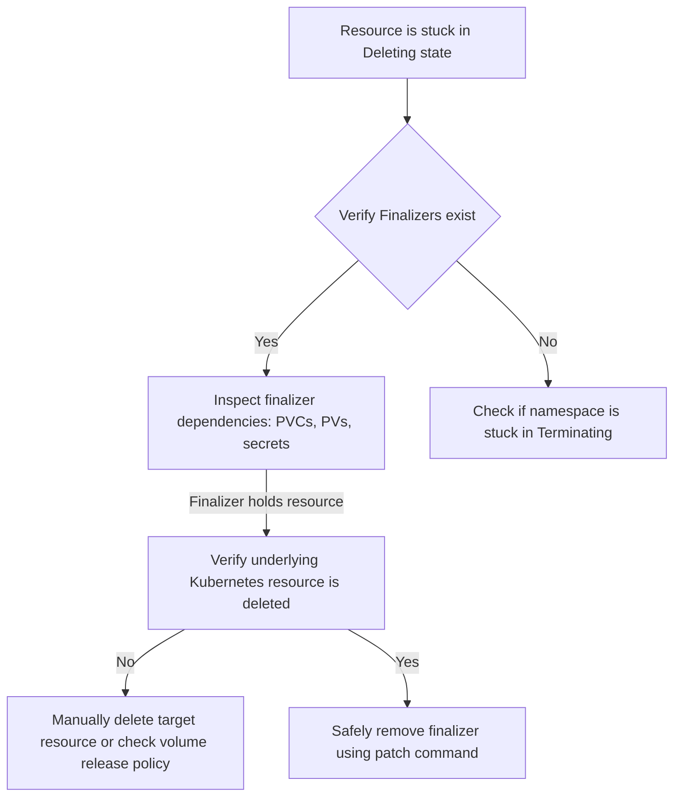
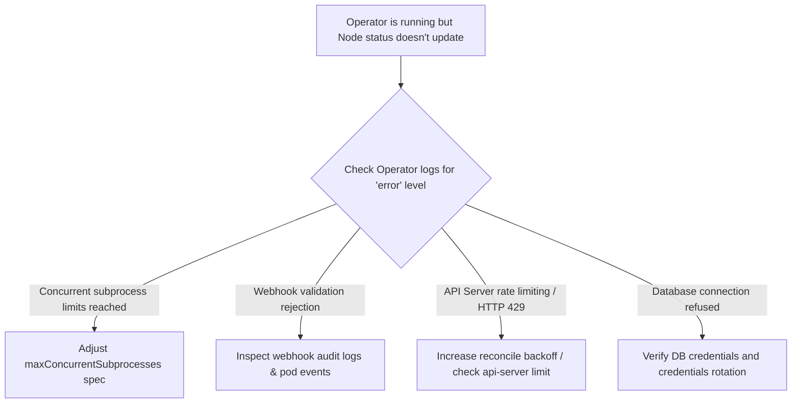

# Operator Troubleshooting Guide

This guide helps operators diagnose, troubleshoot, and resolve issues related specifically to the Stellar-K8s operator, its reconciliation loops, and deployed validator/RPC nodes.

---

## 1. Troubleshooting Decision Trees

### 1.1 Operator Pod Failures & Crashes


### 1.2 Stuck Reconciliation / Resources Stuck in Deleting


### 1.3 Reconciliation Loop Errors / Stuck States


---

## 2. Operator Log Collection & Analysis

### 2.1 Setting Operator Log Level
By default, the operator runs with `RUST_LOG=info`. To enable debug-level logging for deeper inspection:
```yaml
# In the operator deployment spec environment variables:
env:
  - name: RUST_LOG
    value: "debug,kube=info,hyper=info" # Verbose operator logging, keeping libraries quiet
```

Or run dynamically out-of-cluster:
```bash
RUST_LOG=debug cargo run --bin stellar-operator
```

### 2.2 Common Log Patterns & Troubleshooting Actions

| Log Message Pattern | Probable Cause | Diagnostic/Action |
|---|---|---|
| `Reconcile failed: ... ApiError` | The operator cannot update a K8s resource due to conflict or permissions. | Check if RBAC roles have been modified. Look for concurrent updates. |
| `Finalizer removal blocked` | The operator cannot clean up resources because PV/PVC bindings are active. | Ensure the node pods have fully terminated before deletion. |
| `Failed to apply custom validation policy` | The WebAssembly policy webhook failed or returned a deny response. | Check WASM ConfigMap and verify input parameters in `wasm-webhook.md`. |
| `requeue request due to error: ...` | Transient failure in the reconciliation loop. | Observe if error resolves automatically after standard backoff (~5s to 2m). |

---

## 3. Stuck States & Reconciliation Loop Debugging

### 3.1 Resolving Stuck Deletions (Finalizers)
Stellar-K8s uses finalizers to prevent accidental data loss. If a `StellarNode` is stuck in `Deleting`:
1. Check the resource details:
   ```bash
   kubectl describe stellarnode my-validator -n stellar
   ```
2. Verify the finalizer field:
   ```yaml
   finalizers:
     - stellarnode.stellar.org/finalizer
   ```
3. Check the child resources (StatefulSet, Services, PVCs). Often a PVC is protected by `kubernetes.io/pvc-protection` and cannot be deleted because a terminating pod is still locking it.
4. If you have verified that the storage can be safely removed and the resources are orphan, patch the resource to remove the finalizers manually:
   ```bash
   kubectl patch stellarnode my-validator -n stellar \
     --type=merge \
     -p '{"metadata":{"finalizers":null}}'
   ```

### 3.2 Identifying Reconciler Loop Storms
A reconciler loop storm occurs when a resource is constantly updated by the controller, triggering a new reconciliation event indefinitely.
- **Symptom**: Extremely high CPU usage on the operator pod, and the reconciliation logs scroll continuously for the same resource without changes.
- **Root Cause**: The operator modifies a field in the spec or status that triggers a watch event, but doesn't handle the update idempotently.
- **Diagnosis**: Run `stellar-operator diff` to see what is changing:
  ```bash
  stellar-operator diff --name my-validator --namespace stellar
  ```

---

## 4. Performance Bottlenecks & Analysis

### 4.1 Diagnostic Flow for Slow Sync / High CPU
1. **CPU/Memory Metrics**:
   ```bash
   kubectl top pods -n stellar-system
   kubectl top pods -n stellar
   ```
2. **Stellar Core Metrics**: Port-forward to port `11626` and query metrics:
   ```bash
   kubectl port-forward -n stellar my-validator-0 11626:11626
   curl http://localhost:11626/metrics | grep stellar_core
   ```
3. **Common Performance Bottlenecks**:
   - **Disk I/O Latency**: Cloud standard storage (e.g., EBS gp2) is too slow. Upgrade to local NVMe SSDs (`spec.storage.mode: Local`) or premium SSDs.
   - **Database Connection Pool Exhaustion**: Horizon RPC nodes cannot connect to postgres replica pool. Check `stellar-operator-config` feature flags (`enable_read_pool: true`).

---

## 5. Recovery Procedures

### 5.1 Recovery from Database Corruption
If the Stellar Core database becomes corrupted (indicated by `Sqlite` or `Postgres` connection/query errors in container logs):
1. **Stop the workload**:
   ```bash
   kubectl scale statefulset my-validator --replicas=0 -n stellar
   ```
2. **Reinitialize the database**:
   - For PostgreSQL: Execute the database reinitialization scripts or run a clean migration.
   - For Captive Core/embedded: Delete the corrupted database storage volume.
3. **Execute catchup complete**:
   ```bash
   kubectl scale statefulset my-validator --replicas=1 -n stellar
   # Once pod starts, force complete catchup
   kubectl exec my-validator-0 -n stellar -c stellar-node -- stellar-core --c "catchup complete"
   ```

### 5.2 Disaster Recovery Runbook
If a cluster goes down entirely:
1. Re-deploy the Kubernetes operator.
2. Re-create the secrets containing the validator seed.
3. Apply the original `StellarNode` manifests. The operator will dynamically spin up the pods and begin syncing from history archives.
4. Monitor the synchronization progress using `kubectl stellar status`.

---

## 6. Security Incident Response Procedures

In the event of a compromised validator key or suspect container behavior:

### 6.1 Containment: Isolate a Compromised Node
To isolate a compromised pod immediately without deleting the persistent volume:
1. Apply a restrictive NetworkPolicy blocking all ingress/egress:
   ```yaml
   apiVersion: networking.k8s.io/v1
   kind: NetworkPolicy
   metadata:
     name: isolate-node
     namespace: stellar
   spec:
     podSelector:
       matchLabels:
         statefulset.kubernetes.io/pod-name: my-validator-0
     policyTypes:
       - Ingress
       - Egress
   ```
   Apply this manifest to immediately drop all network traffic to and from the pod.

### 6.2 Secret Rotation (Compromised Key)
If a validator seed is compromised:
1. Generate a new validator keypair using Stellar Laboratory.
2. Update the Kubernetes secret referenced by `spec.validatorConfig.seedSecretRef`:
   ```bash
   kubectl create secret generic validator-seed \
     --from-literal=seed=<NEW_SEED> \
     -n stellar --dry-run=client -o yaml | kubectl apply -f -
   ```
3. Restart the validator pod to pick up the new configuration:
   ```bash
   kubectl rollout restart statefulset my-validator -n stellar
   ```

---

## 7. Kubectl Plugin for Faster Diagnosis

The `kubectl-stellar` plugin simplifies node status monitoring:
```bash
# Get sync status of all nodes
kubectl stellar status

# Describe a specific node
kubectl stellar describe my-validator -n stellar

# Print logs with auto-detected containers
kubectl stellar logs my-validator -n stellar -f
```

---

## 8. Dashboard Templates and Monitoring Configuration

Troubleshooting is heavily assisted by the Grafana dashboards included in this repository:
- **Operator Metrics Dashboard**: `monitoring/grafana-dashboard.json`
- **Soroban Metrics Dashboard**: `monitoring/grafana-soroban.json`

**Key Alerts to Monitor**:
- `HighWasmExecutionLatency`: Wasm contract execution times exceed thresholds.
- `HighLedgerIngestionLag`: Sync lag is behind public network.
- `ValidatorNoQuorum`: Stellar consensus protocol quorum set is not reachable.
